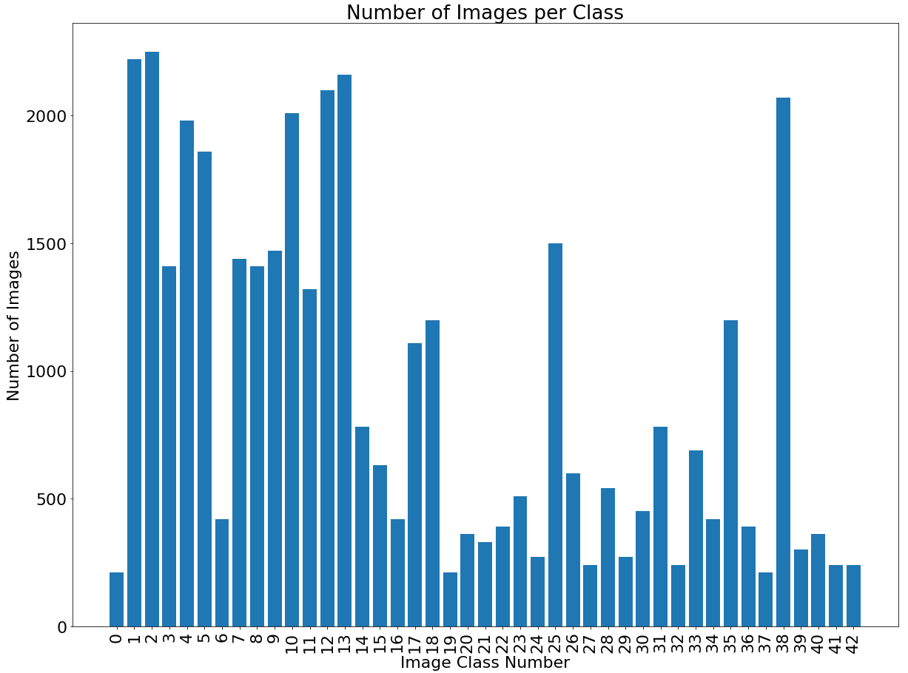
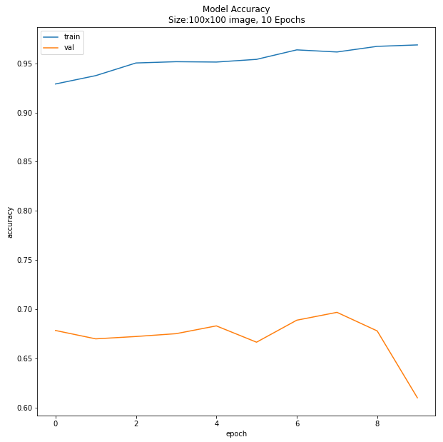

# GTSRB Dataset: Transfer Learning VGG16 for road signs

This project attempts to implement transfer learning by retraining VGG16 network to recognise traffic signs. 
This will be completed by freezing many of the existing layers of the VGG16 network, trained on ImageNet, and adding further classification layers onto the end of the VGG16 network.
Then data from the GTSRB dataset will be processed and fed into the augmented VGG16 network for training.
The network will then be evaluated on never before seen test images to gauge the performance of the model.
This will be iterated to produce the optimal model for classifying traffic sign data.

[Short article written on this project](GTSRB_Transfer_Learning.pdf)

# The Setup

-   Packages are imported.
-   Global variables are set


``` python
import os
import pandas as pd
import numpy as np
import sklearn
import cv2
import tensorflow as tf

from sklearn.preprocessing import StandardScaler
from sklearn.metrics import confusion_matrix, accuracy_score, balanced_accuracy_score, f1_score
from sklearn.model_selection import train_test_split

from tensorflow import keras
from tensorflow.keras.preprocessing.image import ImageDataGenerator, img_to_array, array_to_img, load_img
from tensorflow.keras.utils import to_categorical
from tensorflow.keras.applications.vgg16 import VGG16
from tensorflow.keras.applications.vgg16 import preprocess_input
from tensorflow.keras import layers, models

from keras.models import load_model
from PIL import Image
from matplotlib import pyplot as plt
```


``` python
# Image variables
im_width  = 100
im_height = 100

# Path Variables
collab_path = '/kaggle/input/'
data_path   = collab_path + 'gtsrb-german-traffic-sign/'
```


# The Data

-   Metadata is first imported from the csv files, to understand the
    shape and classes of the data.
-   Training data is split into 80% training, 20% validation & images
    are resized to the target size.
-   Testing data is imported and converted into a resized image array.


``` python
print(os.listdir(data_path))

df_meta  = pd.read_csv(data_path + 'Meta.csv', delimiter=',')
df_test  = pd.read_csv(data_path + 'Test.csv', delimiter=',')
df_train = pd.read_csv(data_path + 'Train.csv', delimiter=',')

# print('Number of Classes: ',df_meta.shape[0])
```


    ['Meta', 'meta', 'Meta.csv', 'Train.csv', 'Test.csv', 'Test', 'test', 'Train', 'train']


``` python
# Lower quality of images by 256 factor & set validation set to 30%
ImDG_train = ImageDataGenerator(rescale=1./255, validation_split=0.3) 
data_train = ImDG_train.flow_from_directory(data_path + 'Train/',
                                            target_size  = (im_width, im_height),
                                            batch_size   = 32,
                                            class_mode   ='categorical',
                                            shuffle      = True,
                                            color_mode   ='rgb',
                                            subset       ='training')

data_valid = ImDG_train.flow_from_directory(data_path + 'Train/',
                                            target_size  = (im_width, im_height),
                                            batch_size   = 32,
                                            class_mode   ='categorical',
                                            shuffle      = True,
                                            color_mode   ='rgb',
                                            subset       ='validation')
```


    Found 27447 images belonging to 43 classes.
    Found 11762 images belonging to 43 classes.


# The Imbalance

-   The data is very imbalanced: A count should be undertaken of each
    unique label in the training set.
-   This count should be used to weight each class in model training.


``` python
# Number of each labels
label_count = [np.sum(df_train["ClassId"].values[:] == i) for i in np.unique(df_train["ClassId"].values)]
# Unique labels
label_order = np.unique(df_train["ClassId"].values)
# The automatic ordering of the training data labels is in a string format
data_keys   = data_train.class_indices.keys()
# Convert strings to integers
int_keys = [int(int_string) for int_string in data_keys]

reclassed_count = [None] * df_meta.shape[0]
reclassed_dict = {}

# Reorganise number of classes to reflect how they're fed into NN
for i,j in zip(int_keys, label_order):
    reclassed_count[j] = label_count[i]
    
total_labels = np.sum(label_count)
balanced_count = [ (1 / i) * (total_labels / 43.0) for i in reclassed_count]

# Make a dict of classes: number of reorganised classes
# for label_order, balanced_ele in zip(label_order, balanced_count):
#     reclassed_dict[label_order] = balanced_ele
# Make a dict of classes: number of reorganised classes
for label, balanced_ele in zip(label_order, reclassed_count):
    reclassed_dict[label] = balanced_ele
```


``` python
plt.figure(figsize = (20,15))
plt.bar(range(len(label_count)), label_count, align='center')
plt.title('Number of Images per Class')
plt.ylabel('Number of Images')
plt.xlabel('Image Class Number')
plt.xticks(label_order, label_order, rotation=90)
plt.rcParams.update({'font.size': 22})
plt.show()


# plt.figure(figsize=(10,10))
# plt.plot(history.history['accuracy'])
# plt.plot(history.history['val_accuracy'])
# plt.legend(['train', 'val'], loc='upper left')
```





# The Model

-   The VGG 16 model is downloaded
-   Input shape is customised to the target shape
-   The model is frozen, so the existing network is not trained - this
    is imperitive to transfer learning


``` python
# Import model without a classification layer (for transfer learning)
vgg_model = VGG16(weights="imagenet", include_top=False, input_shape=(im_width, im_height, 3))

# vgg_model = tf.keras.models.load_model('input/vgg16-weights/vgg16_weights_tf_dim_ordering_tf_kernels_notop.h5')

# Freeze existing model
vgg_model.trainable = False
```


# The Extra Layers

-   Further layers are added to VGG16
-   These layers will be trained to detect patterns in the GTSRB dataset


``` python
# batch_norm_l     = layers.BatchNormalization()
flatten_layer    = layers.Flatten()
# dense_layer1     = layers.Dense(256, activation='relu', kernel_regularizer='l1')
dense_layer1     = layers.Dense(1024, activation='relu')
dense_layer2     = layers.Dense(256, activation='relu')
# prediction_layer = layers.Dense(43, activation='softmax')
# dense_layer      = layers.Dense(512, activation='relu')
# batchnorm_layer  = layers.BatchNormalization()
# dropout_layer    = layers.Dropout(rate=0.2)
prediction_layer = layers.Dense(43, activation='softmax')


model = models.Sequential([
    vgg_model,
    flatten_layer,
#     dense_layer,
#     dropout_layer,
    dense_layer1,
    dense_layer2,
#     batchnorm_layer,
#     dropout_layer,
    prediction_layer
])
#     vgg_model,
#     flatten_layer,
#     dense_layer1,
#     dense_layer2,
#     prediction_layer
```


``` python
model.summary()
```


    Model: "sequential_2"
    _________________________________________________________________
    Layer (type)                 Output Shape              Param #   
    =================================================================
    vgg16 (Functional)           (None, 3, 3, 512)         14714688  
    _________________________________________________________________
    flatten_2 (Flatten)          (None, 4608)              0         
    _________________________________________________________________
    dense_6 (Dense)              (None, 1024)              4719616   
    _________________________________________________________________
    dense_7 (Dense)              (None, 256)               262400    
    _________________________________________________________________
    dense_8 (Dense)              (None, 43)                11051     
    =================================================================
    Total params: 19,707,755
    Trainable params: 4,993,067
    Non-trainable params: 14,714,688
    _________________________________________________________________


# Run the model

-   Model is running using the class weight calculated above.
-   A early stopping callback is implemented to stop training if no
    progress is made for 7 epochs


``` python
from tensorflow.keras.callbacks import EarlyStopping

model.compile(
    optimizer='adam',
    loss='categorical_crossentropy',
    metrics=['accuracy'],
)


es = EarlyStopping(monitor='val_accuracy', mode='max', patience=5,  restore_best_weights=True)

history = model.fit(data_train, epochs=10, validation_data=data_valid, batch_size=128, callbacks=[es], class_weight=reclassed_dict)
```


    Epoch 1/10
    858/858 [==============================] - 59s 68ms/step - loss: 241.9603 - accuracy: 0.9290 - val_loss: 1.7503 - val_accuracy: 0.6784
    Epoch 2/10
    858/858 [==============================] - 47s 55ms/step - loss: 215.2130 - accuracy: 0.9375 - val_loss: 1.9765 - val_accuracy: 0.6699
    Epoch 3/10
    858/858 [==============================] - 46s 54ms/step - loss: 168.4046 - accuracy: 0.9504 - val_loss: 1.9827 - val_accuracy: 0.6722
    Epoch 4/10
    858/858 [==============================] - 46s 54ms/step - loss: 161.9462 - accuracy: 0.9517 - val_loss: 2.1106 - val_accuracy: 0.6751
    Epoch 5/10
    858/858 [==============================] - 46s 54ms/step - loss: 152.1284 - accuracy: 0.9513 - val_loss: 1.9324 - val_accuracy: 0.6830
    Epoch 6/10
    858/858 [==============================] - 47s 55ms/step - loss: 149.3463 - accuracy: 0.9541 - val_loss: 2.1724 - val_accuracy: 0.6665
    Epoch 7/10
    858/858 [==============================] - 48s 56ms/step - loss: 121.3920 - accuracy: 0.9637 - val_loss: 2.3541 - val_accuracy: 0.6888
    Epoch 8/10
    858/858 [==============================] - 46s 54ms/step - loss: 125.7988 - accuracy: 0.9616 - val_loss: 2.1482 - val_accuracy: 0.6968
    Epoch 9/10
    858/858 [==============================] - 46s 53ms/step - loss: 112.7575 - accuracy: 0.9673 - val_loss: 2.1271 - val_accuracy: 0.6779
    Epoch 10/10
    858/858 [==============================] - 47s 54ms/step - loss: 103.4568 - accuracy: 0.9687 - val_loss: 3.0978 - val_accuracy: 0.6099


``` python
model.save("VG10-100-2DNN-(42).h5")
```


``` python
plt.figure(figsize=(10,10))
plt.plot(history.history['accuracy'])
plt.plot(history.history['val_accuracy'])
plt.title('Model Accuracy\nSize:100x100 image, 10 Epochs')
plt.ylabel('accuracy')
plt.xlabel('epoch')
plt.legend(['train', 'val'], loc='upper left')
plt.show()
```





``` python
plt.figure(figsize=(10,10))
plt.plot(history.history['loss'])
plt.plot(history.history['val_loss'])
plt.title('Model Loss\nSize:100x100 image, 10 Epochs')
plt.ylabel('loss')
plt.xlabel('epoch')
plt.legend(['train', 'val'], loc='upper left')
plt.show()
```


# Testing the model

-   The model is tested and accuracy is determined
-   A table is created to show prediction probability vs true
    probability


``` python
test_labels = df_test["ClassId"].values
test_imgs   = df_test["Path"].values

data_test = []
for img in test_imgs:
    try:
        test_im         = cv2.imread(data_path + img)
        image_fromarray = Image.fromarray(test_im, mode='RGB')
        resize_image    = image_fromarray.resize((im_height, im_width))
        data_test.append(np.array(resize_image))
    except:
        print("Error in " + img)

data_test = np.array(data_test)
data_test = data_test/255
```


``` python
# model = keras.models.load_model('/kaggle/input/vgg102442dnnnoacch5/VGG10-244-2DNN-(no-Acc).h5')
```


    2022-12-23 14:54:41.854260: I tensorflow/core/common_runtime/process_util.cc:146] Creating new thread pool with default inter op setting: 2. Tune using inter_op_parallelism_threads for best performance.


``` python
pred_array = model.predict(data_test)
pred_class = [int(list(data_train.class_indices.keys())[i]) for i in pred_array.argmax(axis=-1)]
print('Test Data accuracy: ', accuracy_score(test_labels, pred_class)*100)
```


    2022-12-23 16:47:56.912762: W tensorflow/core/framework/cpu_allocator_impl.cc:80] Allocation of 1515600000 exceeds 10% of free system memory.
    2022-12-23 16:47:58.836215: W tensorflow/core/framework/cpu_allocator_impl.cc:80] Allocation of 1515600000 exceeds 10% of free system memory.


    Test Data accuracy:  42.0110847189232


``` python
from sklearn.metrics import confusion_matrix, ConfusionMatrixDisplay
import seaborn as sns
confusion_matrix  = confusion_matrix(test_labels, pred_class)
# cm_display = metrics.ConfusionMatrixDisplay(confusion_matrix)
# cm_display.plot()
# plt.show()
# Plot confusion matrix in a beautiful manner

fig = plt.figure(figsize=(16, 14))
ax= plt.subplot()
sns.heatmap(confusion_matrix, annot=True, ax = ax, fmt = 'g'); #annot=True to annotate cells
# labels, title and ticks
ax.set_xlabel('Predicted Class', fontsize=30)
ax.xaxis.set_label_position('bottom')
plt.xticks(rotation=90)
# ax.xaxis.set_ticklabels(class_names, fontsize = 10)
ax.xaxis.tick_bottom()

ax.set_ylabel('True Class', fontsize=30)
# ax.yaxis.set_ticklabels(class_names, fontsize = 10)
plt.yticks(rotation=0)

plt.title('Confusion Matrix - 10 Epochs', fontsize=30)

plt.savefig('ConMat24.png')
plt.show()
```


``` python
results_pd = pd.DataFrame({'True Label': test_labels})
prob_truth = []
prob_pred  = []

for i in range(pred_array.shape[0]): 
  prob_truth.append(pred_array[i][int_keys.index(test_labels[i])]*100)
  prob_pred.append(pred_array[i][int_keys.index(pred_class[i])]*100) 

results_pd['True Prob']  = prob_truth
results_pd['Prediction'] = pred_class
results_pd['Pred Prob']  = prob_pred


results_pd[0:20]
```

| **True Label** | **True Confidence** | **Predicted Label** | **Prediction Confidence** |
|----------------|---------------|----------------|---------------|
| 16            | 9.999955e+01   | 16            | 99.999547 |
| 1             | 6.064131e+01   | 1             | 60.641307 |
| 38            | 9.993995e+01   | 38            | 99.939954 |
| 33            | 3.565841e-09   | 12            | 82.365721 |
| 11            | 2.136319e+00   | 25            | 84.338760 |
| 38            | 9.999697e+01   | 38            | 99.996972 |
| 18            | 4.531513e+01   | 11            | 49.823451 |
| 12            | 1.742812e+00   | 13            | 98.210150 |
| 25            | 5.211430e+01   | 25            | 52.114296 |
| 35            | 2.973128e+00   | 17            | 97.014755 |
| 12            | 7.065818e+01   | 12            | 70.658177 |
| 7             | 9.185006e+01   | 7             | 91.850060 |
| 23            | 2.139559e+01   | 25            | 39.188302 |
| 7             | 7.248833e-04   | 10            | 99.739599 |
| 4             | 4.509032e-02   | 1             | 73.479307 |
| 9             | 1.173987e+00   | 10            | 79.373062 |
| 21            | 3.444374e-04   | 25            | 73.456132 |
| 20            | 7.444156e+00   | 22            | 67.783433 |
| 27            | 3.192390e-01   | 11            | 82.631904 |
| 38            | 7.172617e+00   | 14            | 80.937457 |


``` python
```

